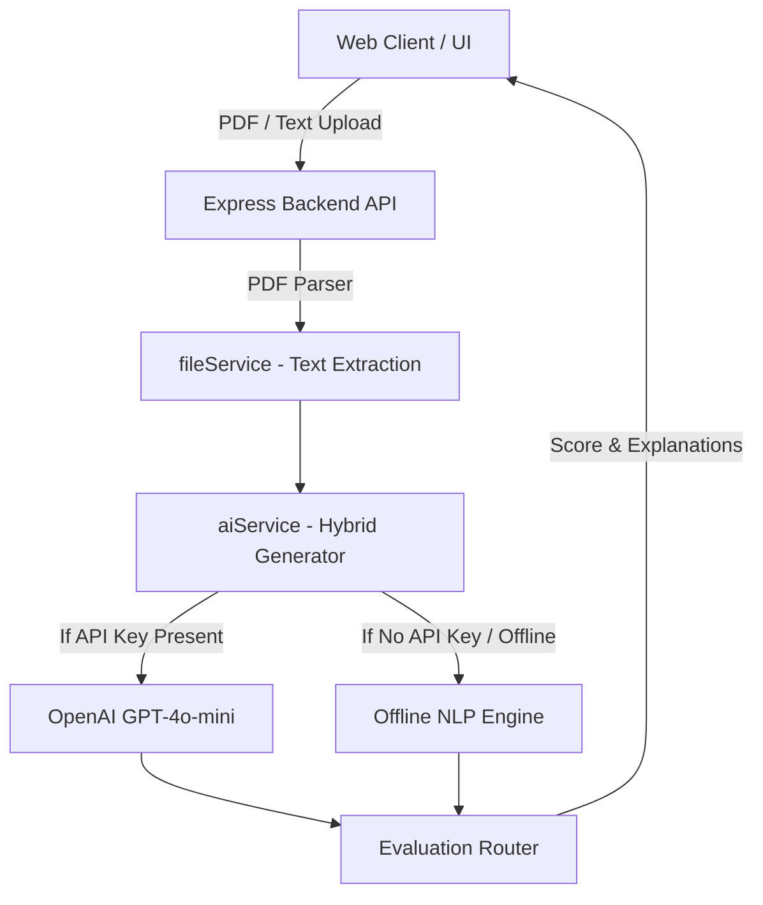

# ⚡ BrainSpark AI - Intelligent Study & Quiz Platform

[](https://github.com/primus2412/project-school/actions)
[](https://nodejs.org/)
[](https://expressjs.com/)
[](https://www.docker.com/)
[](LICENSE)

**BrainSpark AI** is a production-grade full-stack web application designed to convert raw study materials (text or PDF documents) into interactive multiple-choice assessment quizzes. Features hybrid AI architecture: powered by OpenAI GPT-4o-mini with an automated fallback to a smart offline NLP sentence-parsing engine.

---

## ✨ Key Features

- 📄 **PDF & Raw Text Parsing**: Instant text extraction from uploaded study PDFs or raw notes.
- 🤖 **Hybrid AI Quiz Generator Engine**:
  - **Online Mode**: Integrates OpenAI API (`gpt-4o-mini`) for contextually rich questions.
  - **Offline Fallback**: Built-in rule-based NLP engine using keyword extraction and distractor generation when unconfigured.
- ⏱️ **Interactive Quiz UI**: Real-time timer, progress indicator, and glassmorphism interface.
- 📊 **Instant Performance Scorecard**: Detailed answer evaluation, score percentage, and explanation breakdown.
- 🐳 **Containerized & CI Ready**: Dockerfile, `docker-compose`, and GitHub Actions CI workflow included.

---

## 🏗️ Architecture & Data Flow



---

## 🚀 Quick Start

### 1. Installation
```bash
git clone https://github.com/primus2412/project-school.git
cd project-school
npm install
```

### 2. Environment Setup (Optional)
Create a `.env` file in the root directory:
```env
PORT=5000
OPENAI_API_KEY=your_openai_api_key_here
```
*(If no API key is provided, the system seamlessly uses the offline smart NLP engine).*

### 3. Run Locally
```bash
npm start
```
Open your browser at: `http://localhost:5000`

### 4. Run Tests
```bash
npm test
```

### 5. Run with Docker
```bash
docker-compose up --build
```

---

## 📄 License
MIT License. Created by [primus2412](https://github.com/primus2412).